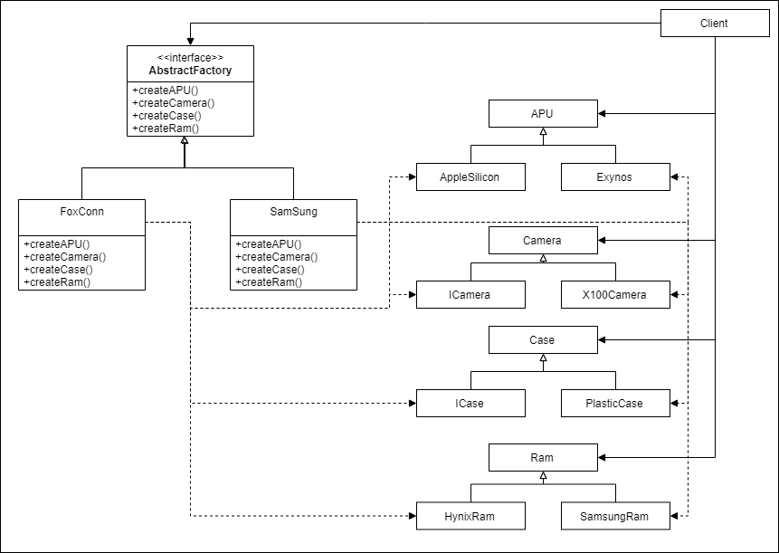

# 추상 팩토리 패턴

## 의도

상세화된 서브클래스를 정의하지 않고도 서로 관련성이 있거나 

독립적인 여러 객체의 군을 생성하기 위한 인터페이스를 제공하기 위해 사용.

## 언제 사용해야 할까?

* 객체 생성과 객체를 사용하는 시스템을 독립적으로 구성하기 위해서.
* 여러 객체 군을 시스템이 사용하기 위해,
  다른것으로도 대체를 쉽게 하기 위해서.
* 여러 객체 군을 함께 사용할 수 있어야 할때.
* 제품에 대한 클래스 라이브러리를 세부 정보를 노출없이 제공하고 싶을 때
    * 클래스의 구현으로 제공이 아닌 인터페이스만 노출시키고 싶을 경우.
    
여러 팩토리에서 객체를 생산하며, 

생산된 객체가 무엇인지 몰라도 객체의 인터페이스만으로도 조작할 수 있음.

### 예제소스 구조도

